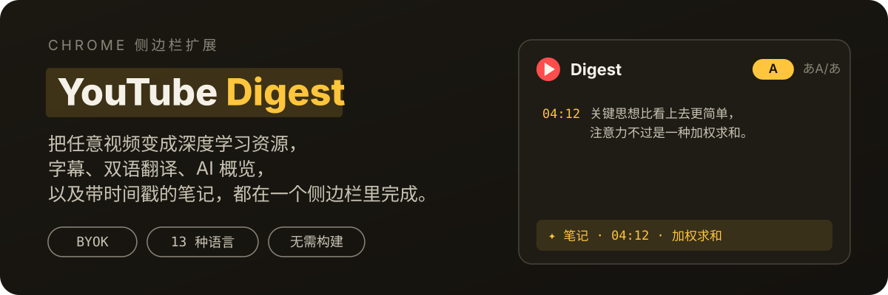
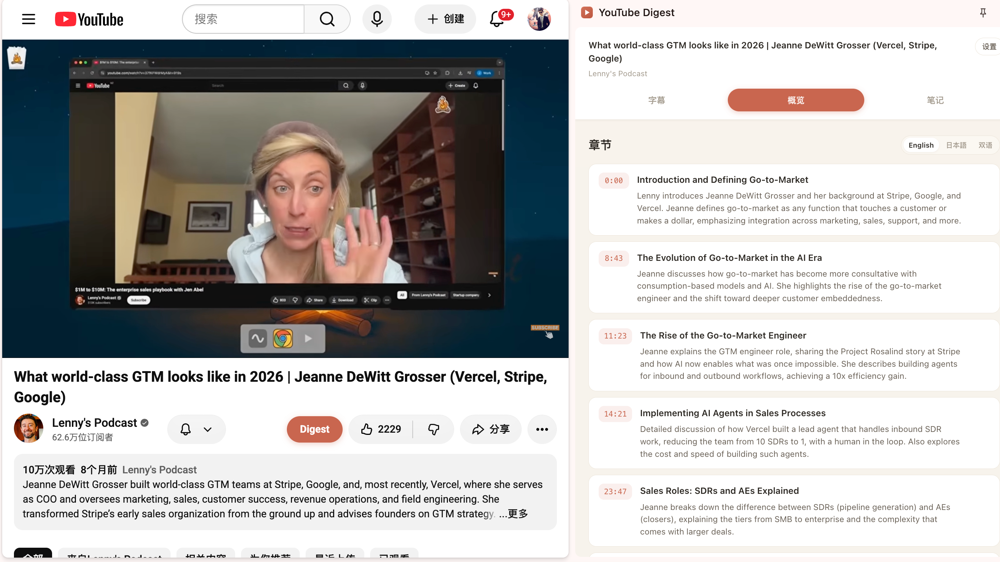
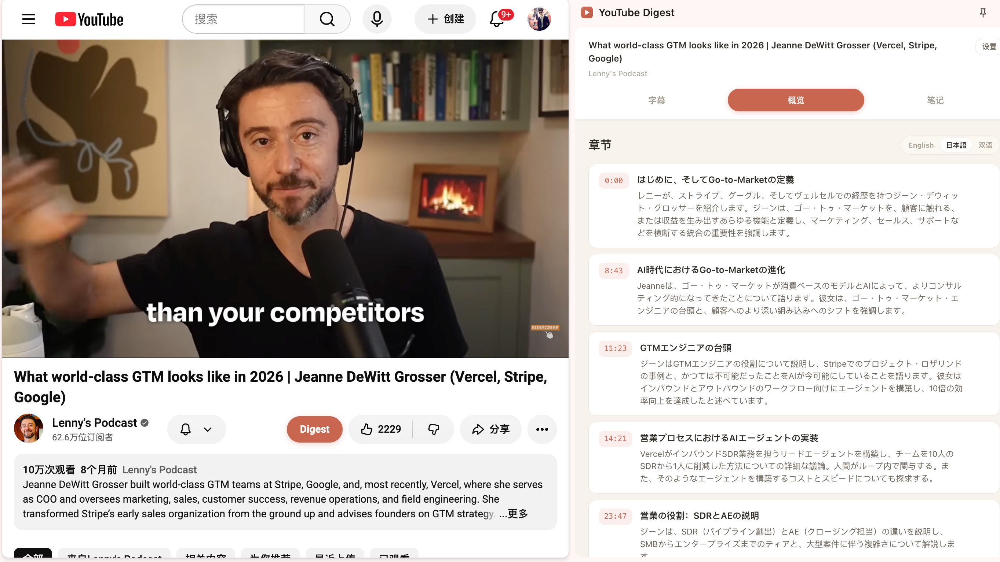
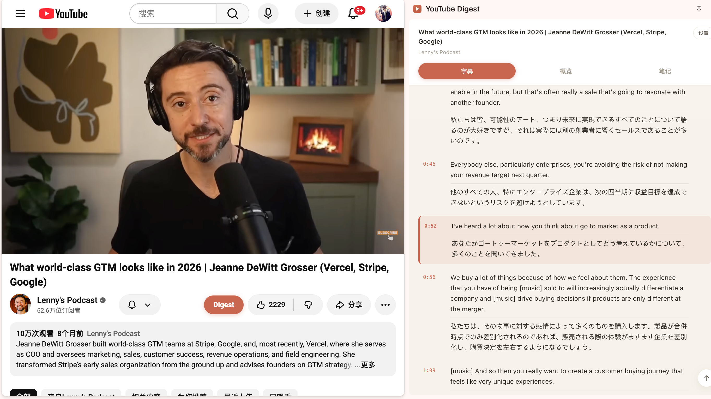
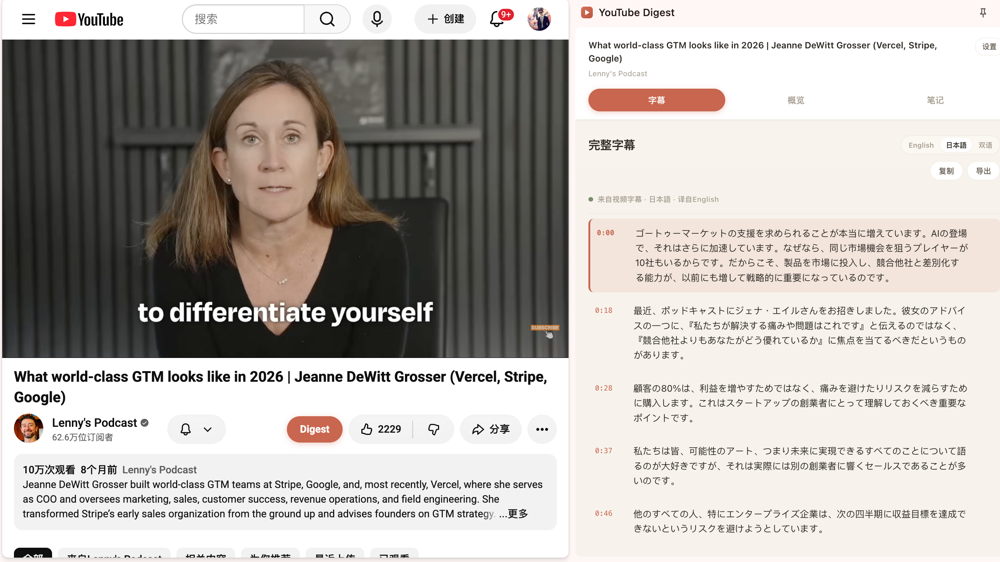
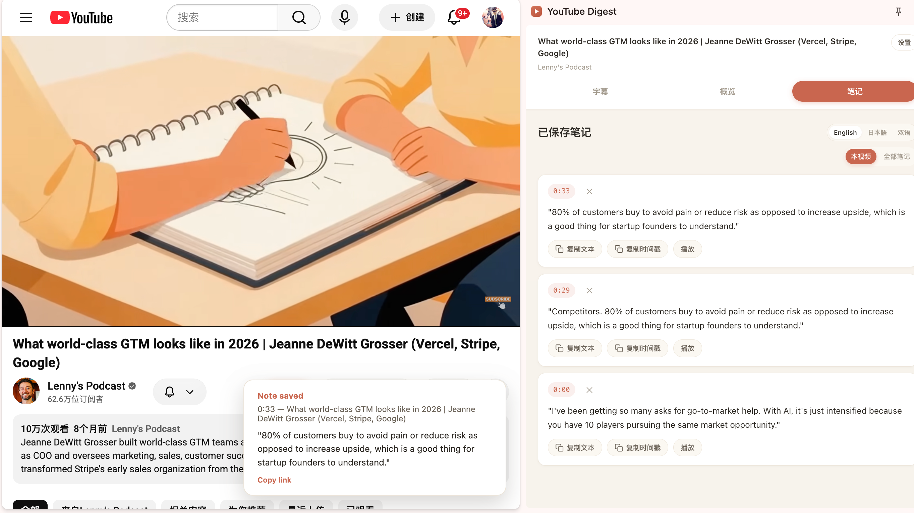
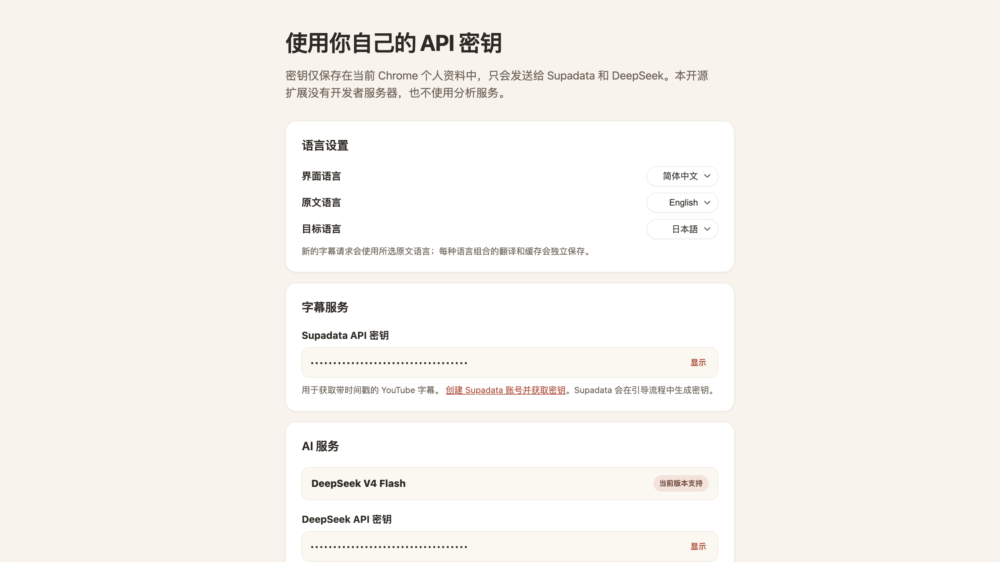
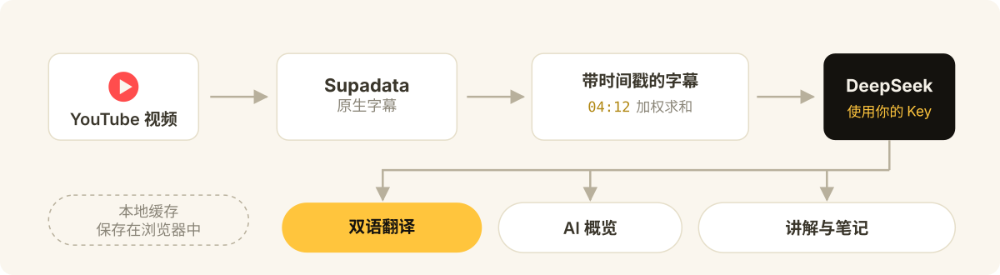

<p align="center">
  
</p>

<p align="center">
  <a href="README.md">English</a> | <a href="README.zh-CN.md">简体中文</a> | <a href="README.zh-TW.md">繁體中文</a>
</p>

<p align="center">
  
  
  
  
</p>

把每个 YouTube 视频变成一份可以深入学习的资料。YouTube Digest 把字幕、双语翻译、AI 概览、内容讲解和时间戳笔记放进同一个 Chrome 侧边栏，让你可以持续学习视频中的知识和语言，同时不丢失原视频上下文。

- 把零碎字幕变成清晰、可搜索的学习资料。
- 查看原文、13 种可选语言的翻译，或双语对照字幕来学习语言。
- 通过 AI 概览、章节、重点引用和选中文本讲解建立系统理解。
- 点击字幕、概览或笔记中的时间戳，快速跳转到对应位置。
- 保存自动润色的时间戳笔记，方便之后复习。
- 使用自己的 API Key，数据保存在本地 Chrome 中，不包含分析统计或行为追踪。

YouTube Digest 是一个需要自行提供 API Key 的开源项目，通过 GitHub 安装。目前没有上架 Chrome 应用商店，不赠送 API 额度，也没有开发者运营的服务器。

## 演示图片

| **概览** | **日语概览** |
| :---: | :---: |
|  |  |
| **双语字幕** | **日语字幕** |
|  |  |
| **笔记** | **设置** |
|  |  |

## 工作原理

<p align="center">
  
</p>

扩展只与两个服务通信，且都在你自己的账号下：**Supadata** 获取视频的原生字幕，**DeepSeek** 负责翻译、概览、讲解和笔记润色。Key、设置、笔记和近期缓存都保存在你设备的 Chrome 本地存储中。没有 YouTube Digest 账号系统、广告、分析统计或行为追踪。详见[隐私与数据流](#隐私与数据流)。

## 让你的编程 Agent 帮你安装

你不需要看懂代码，也不需要会使用命令行。把下面这段话发送给你的编程 Agent：

> 请把这个项目下载或克隆到我选择的长期保留文件夹，告诉我准确的完整路径，并让 Chrome“加载已解压的扩展程序”使用同一个文件夹。如果我在第一次安装时需要位置建议，可以推荐 macOS 或 Linux 上的 `~/Documents/youtube-digest`，或 Windows 上的 `%USERPROFILE%\Documents\youtube-digest`，但不要假设我一定使用这些路径。请用简单易懂的语言一步一步指导我完成安装和配置。https://github.com/wangruofeng/youtube-digest

你的 Agent 应该帮你：

1. 先询问你想把项目长期保存在哪里，再下载或克隆到那里，并告诉你准确的完整路径。如果你需要建议，可以推荐 macOS 或 Linux 上的 `~/Documents/youtube-digest`，或 Windows 上的 `%USERPROFILE%\Documents\youtube-digest`。
2. 打开下方 Supadata 和 DeepSeek 官方页面，指导你创建自己的账号。
3. 指导你在 Chrome 中通过“加载已解压的扩展程序”选择你刚才确定的那个准确项目文件夹。
4. 告诉你应该在扩展的“设置”页面哪个位置填写 API Key。
5. 打开一个带字幕的 YouTube 视频，确认字幕和翻译功能可以使用。

安装后请让这个文件夹留在原位。如果移动或删除它，Chrome 中加载的本地扩展会失效，需要从新的长期存放位置重新加载。

不要把 API Key 发送到 AI 对话、源代码、截图或公开消息中。请你自己在 YouTube Digest 的设置页面直接填写。编程 Agent 可以告诉你填写位置，但不需要看到 Key。

<details>
<summary><strong>手动安装</strong></summary>

如果你想自己操作：

1. 打开 [github.com/wangruofeng/youtube-digest](https://github.com/wangruofeng/youtube-digest)。
2. 点击 **Code**，再选择 **Download ZIP**。
3. 选择一个长期保留的文件夹，并把项目解压到这里。可选建议是 macOS 或 Linux 上的 `~/Documents/youtube-digest`，或 Windows 上的 `%USERPROFILE%\Documents\youtube-digest`。你也可以使用其他文件夹。
4. 在 Chrome 地址栏打开 `chrome://extensions`。
5. 打开右上角的“开发者模式”。
6. 点击“加载已解压的扩展程序”。
7. 选择你刚才确定的那个准确项目文件夹，其中必须包含 `manifest.json`。
8. 如果需要，可以在 Chrome 扩展菜单中固定 YouTube Digest。

这是一个本地加载的扩展，不会自动更新。下载新版或让 Agent 修改代码后，请在 `chrome://extensions` 中找到 YouTube Digest 并点击“重新加载”，然后刷新已经打开的 YouTube 页面。如果移动或删除源代码文件夹，Chrome 中加载的扩展会失效，需要从新的位置重新加载。

</details>

## 设置 API Key

YouTube Digest 需要你在自己的服务账号中准备两个 Key：

1. **Supadata API Key**，用于获取 YouTube 字幕。
2. **DeepSeek API Key**，用于概览、讲解、翻译和笔记自动润色。

<details>
<summary><strong>获取 Supadata API Key</strong></summary>

1. 打开 [Supadata 官方注册页面](https://dash.supadata.ai/auth/sign-up)。
2. 创建账号并完成简短的引导流程。
3. Supadata 会在引导过程中自动生成一个 API Key。
4. 随时可以打开 [Supadata 控制台](https://dash.supadata.ai/) 查看或管理 Key。
5. 复制 Key，粘贴到 YouTube Digest 设置页的 **Supadata API key** 输入框。

如果控制台流程有变化，请参考 [Supadata 官方文档](https://docs.supadata.ai/)。

</details>

<details>
<summary><strong>获取 DeepSeek API Key</strong></summary>

1. 打开 [DeepSeek 官方 API Keys 页面](https://platform.deepseek.com/api_keys)。
2. 按提示登录或注册 DeepSeek 平台账号。
3. 点击 **Create new API key**，起一个容易辨认的名字（例如 `YouTube Digest`）并创建。
4. 立即复制 Key。完整 Key 可能只显示一次。
5. 粘贴到 YouTube Digest 设置页的 **DeepSeek API key** 输入框。
6. 如果 DeepSeek 提示余额不足，请在 DeepSeek 平台账号中充值后重试。

当前账号与 API 细节请参考 [DeepSeek 官方 API 文档](https://api-docs.deepseek.com/)。

</details>

从侧边栏打开 **设置**。你也可以在 `chrome://extensions` 的 YouTube Digest 卡片上打开“选项”页，或右键点击工具栏图标进入。请只在这些设置页输入框中粘贴 Key。不要把 Key 粘贴到 AI 对话、仓库文件、截图或公开消息中。

当前发布版本仅支持 DeepSeek V4 Flash 作为 AI 提供方：

```text
Base URL: https://api.deepseek.com
Model: deepseek-v4-flash
```

YouTube Digest 的所有 DeepSeek 请求都使用非思考模式，以获得快速、可预期的交互。接口和模型在设置中固定，你唯一需要填写的 AI 凭证就是 DeepSeek API Key。如果想换提供方或模型，请复制设置页中的安全定制提示词，交给编程 Agent 修改你的本地副本。不要在该提示词或对话中包含任何 API Key。

Key 和设置保存在你设备上 Chrome 的本地扩展存储中。发布构建不包含也不使用 `config.js`。

## 使用 YouTube Digest

1. 打开一个带字幕的常规 YouTube 观看页面。
2. 点击 YouTube Digest 扩展图标，打开侧边栏。
3. 阅读带时间戳的字幕，或在原文、翻译和双语对照视图之间切换。滚动到字幕深处后，右下角会出现“回到顶部”按钮。
4. 想要 AI 生成的章节和重点引用时，打开 **Overview**。它有同样的语言切换，翻译后的章节和引用会按视频缓存。
5. 想要 AI 讲解时，选中一段字幕文本。
6. 从播放器或重点引用保存笔记，之后在 **Notes** 中 revisit，同样支持原文、翻译和双语视图。

侧边栏界面语言跟随你在设置中选择的语言：在 English 和 中文 之间切换，面板文案会随之切换。设置中还支持从 13 种语言中选择原文和目标翻译语言；翻译及其缓存按语言对分开保存。内容模式总是从原文开始，直到你选择翻译。

## 当前支持范围

- Google Chrome 116 或更新版本，使用 Side Panel API。
- 常规 `youtube.com/watch` 视频页面。
- Supadata 返回的原生字幕。YouTube Digest 会请求你在设置中选择的原生语言，默认偏好英语，但也可能显示其他原生语言。
- 字幕、AI 概览（章节和重点引用）、已保存笔记的原文、翻译、双语对照视图。
- 13 种翻译语言（英语、简体中文、繁体中文、日语、韩语、印地语、西班牙语、法语、阿拉伯语、孟加拉语、葡萄牙语、俄语、乌尔都语），可在设置中选为原文和目标语言对，翻译按视频和语言对缓存。
- 英文和简体中文界面文案，跟随设置中保存的首选语言。
- AI 概览、选中文本讲解、翻译、笔记自动润色。
- 本地笔记，以及近期字幕和摘要结果的本地缓存。
- 所有已发布 AI 功能使用 DeepSeek V4 Flash。其他提供方需要本地修改代码，发布版本不予支持。

Shorts、直播、私有或访问受限的视频，以及没有可用原生字幕的视频可能无法使用。Firefox、Safari、移动浏览器和其他 Chromium 浏览器目前未测试、不支持。

YouTube Digest 强制使用 Supadata 的 `mode=native`。当原生字幕不可用时，它不会请求 AI 生成字幕，也不会进行本地音频转写。

<details>
<summary><strong>Supadata 免费额度与请求成本</strong></summary>

截至 2026 年 8 月 9 日，[Supadata 定价页](https://supadata.ai/pricing)列出免费档每月 **100 积分**，无需信用卡。未用积分不累积。Supadata 定价可能变化，依赖这些数字前请查看当前页面。

[Supadata 字幕文档](https://docs.supadata.ai/get-transcript)说明了字幕请求模式和积分消耗：

- 原生字幕请求消耗 **1 积分**，与视频时长无关。
- 生成式字幕消耗 **每视频分钟 2 积分**。YouTube Digest 强制 `mode=native`，不走这条路。
- 原生字幕不可用、返回 HTTP `206` 的查询仍消耗 **1 积分**。

按当前仅原生模式的行为，每次请求一次成功时，免费档大约可覆盖每月 100 次字幕查询。重试和不可用字幕的查询也消耗积分，实际成功覆盖的视频数可能更低。

DeepSeek 用量与 Supadata 分开。DeepSeek 有自己的免费额度、限流或计费策略。YouTube Digest 不收费、不转售访问。请设置消费上限并关注两个账号。下方估算说明当前 DeepSeek 翻译成本。

</details>

<details>
<summary><strong>DeepSeek V4 Flash 翻译成本估算</strong></summary>

截至 2026 年 8 月 10 日，DeepSeek 官方[定价页](https://api-docs.deepseek.com/quick_start/pricing/)每百万 token 价格：

- 缓存命中输入：**$0.0028 美元**。
- 缓存未命中输入：**$0.14 美元**。
- 输出：**$0.28 美元**。

DeepSeek 表示这些价格可能即将上调，依赖此估算前请查看当前定价页。官方 [token 用量指南](https://api-docs.deepseek.com/quick_start/token_usage/)估算每英文字符约 0.3 token、每中文字符约 0.6 token。[上下文缓存指南](https://api-docs.deepseek.com/guides/kv_cache/)解释了用于重复前缀的自动尽力磁盘缓存。

一段实测的 20 分钟英文演讲包含 **2,935 个英文口语单词**、15,433 个字幕字符。按 YouTube Digest 当前分组，它被切分为 128 个语义段、43 次请求（每次三段）。重复提示词和 JSON 使渲染后输入约 108,528 个英文字符，按 0.3 token/字符估算约 **32,600 输入 token**。翻译后的中文 JSON 输出按 0.6 token/字符估算约 3,500 至 4,500 token，外加 JSON 和 ID 开销。

若全部输入按缓存未命中计费，输入约 $0.0046，输出约 $0.0010 至 $0.0013，合计约 $0.0056 至 $0.0059。当大部分重复系统提示命中 DeepSeek 自动缓存时，现实的下限约 $0.002 至 $0.003。因此完整翻译这段演讲的实际估算是 **$0.002 至 $0.006 美元，约 ¥0.02 至 ¥0.04**。

翻译是惰性、渐进的。已缓存分段会被复用，只有你滚动到的行才会发起调用。重试、提供方行为和价格变化可能提高最终成本。

</details>

## 用你的编程 Agent 改造它

这是一个个人改造项目，不接受上游 issue 和 pull request。如果哪里坏了或想要新功能，请下载或 fork 你自己的副本，让你的编程 Agent 修复、改造或个性化。

YouTube Digest 使用纯 HTML、CSS 和 JavaScript，无需构建步骤，非常适合作为 Agent 辅助项目的起点。请让你的 Agent 保持自备 Key 模式、不把密钥写进源码、运行[下方检查](#给编程-agent-的检查命令)，并在真实视频上测试改造结果。

<details>
<summary><strong>可以尝试的方向</strong></summary>

- 为课程、访谈、教程、评测或学术讲座创建定制摘要模板。
- 做一个生词本，保存单词、原句、释义和视频时间戳。
- 把笔记和生词导出为 Markdown、CSV、Anki 或其他学习工具格式。
- 添加个人主题过滤器，高亮与目标最相关的章节。
- 在 AI 提供方设置卡片中添加可见的其他模型配置入口。
- 增加可选的本地模型支持，获得不同的隐私与成本权衡。
- 通过键盘导航、字体控制、更高对比度主题改进无障碍体验。

</details>

如果想换 AI 提供方或模型，先在编程 Agent 中打开 Chrome 通过“加载已解压的扩展程序”加载的那个 YouTube Digest 项目文件夹。然后打开 YouTube Digest 设置，使用“复制定制提示词”。发送前替换 `[PROVIDER]` 和 `[MODEL]` 占位符。不要在提示词或对话中包含任何 API Key。Agent 更新本地副本后，你自己在其指出的设置字段中填写 Key。

## 隐私与数据流

YouTube Digest 直接从扩展发起服务请求：

1. 向 Supadata 发送标准化的 YouTube 观看链接，请求原生字幕。
2. 在你请求 AI 功能时，向 DeepSeek 发送字幕和相关视频元数据。
3. 聚焦功能只发送所需内容，例如选中文本及其上下文，或翻译用的小批量字幕。
4. Key、设置、笔记和近期缓存在 Chrome 本地保存。

没有 YouTube Digest 账号系统、广告、分析统计或行为追踪。Supadata 和 DeepSeek 仍会按各自条款和隐私政策接收数据。详见 [PRIVACY.md](PRIVACY.md)。

<details>
<summary><strong>故障排查</strong></summary>

### YouTube 视频上看不到 Digest 按钮

- 在 `chrome://extensions` 找到 YouTube Digest 并点击“重新加载”，然后刷新 YouTube 页面。
- 确认你在常规 `https://www.youtube.com/watch?...` 页面，而不是 Short、嵌入或直播页。
- 当前版本会自动跟随 YouTube 响应式操作栏的变化。页面加载完成后稍等片刻。
- 如果你使用的是较早下载的副本，水平调整一次 YouTube 窗口宽度可能让按钮出现。之后请下载最新版本，不再需要调整窗口。
- 如果仍然看不到，让你的编程 Agent 在那个视频页上检查 content script。

### 侧边栏打不开

- 确认你在常规 `https://www.youtube.com/watch?...` 页面。
- 在 `chrome://extensions` 确认 YouTube Digest 已启用，并点击“重新加载”。
- 重新加载扩展后刷新 YouTube 页面。
- 如果问题持续，让你的编程 Agent 检查扩展。

### YouTube Digest 提示需要设置

- 打开 **设置**，保存 Supadata Key 和 DeepSeek Key。
- 当前发布版本使用固定的 DeepSeek V4 Flash 接口和模型，没有 Base URL 或 Model 字段可配置。
- 如果设置页提示旧的自定义提供方已移除，请填写 DeepSeek Key。旧的 AI Key 已被清除，避免被误用于其他服务。

### 找不到字幕

- 确认视频是公开的且有原生字幕。
- 检查你的 Supadata Key、剩余积分、限流和账号状态。
- 注意原生字幕不可用的查询和手动重试仍可能消耗积分。

YouTube Digest 不会回退到生成式转写。

### AI 请求失败

- `401` 或 `403` 通常表示 DeepSeek Key 或账号权限无效。
- `429` 通常表示达到了 DeepSeek 限流或消费上限。
- 确认 Key 是在上方链接的 DeepSeek 平台账号中创建的，且账号有可用余额。
- 如果你为其他模型改造过本地副本，请再次使用设置页的定制提示词，让你的编程 Agent 检查该本地实现。

不要在对话、截图或日志中分享 API Key、私人字幕或个人笔记。

</details>

## 给编程 Agent 的检查命令

让你的编程 Agent 在修改项目后运行：

```bash
npm test
npm run check
npm run package
```

Agent 还应在 Chrome 中重新加载本地扩展，并用多个真实 YouTube 视频测试。自动化检查不能证明真实的服务请求和 YouTube 交互可用。

## 许可证

MIT，见 [LICENSE](LICENSE)。
