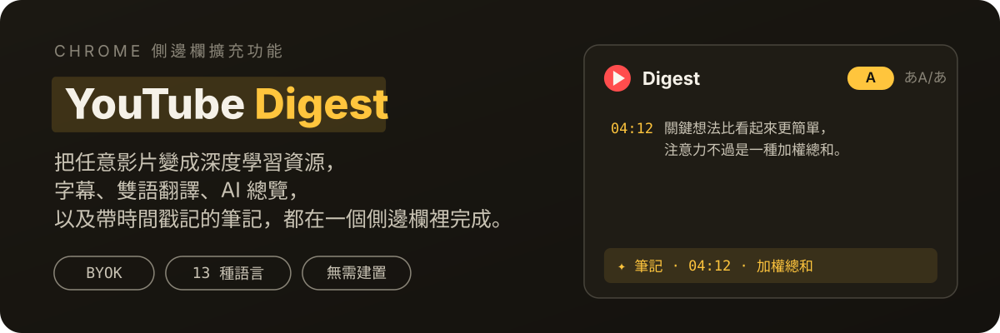
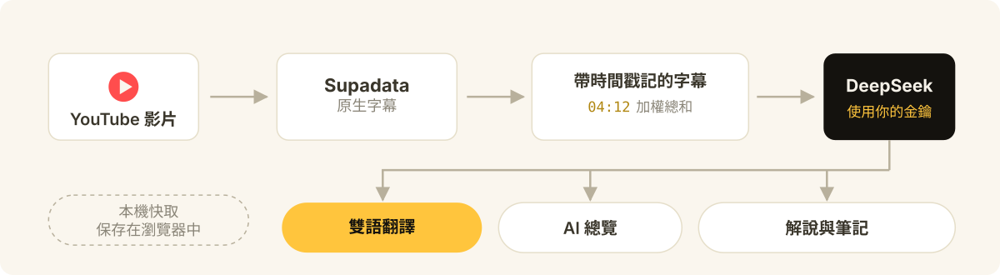

<p align="center">
  
</p>

<p align="center">
  <a href="README.md">English</a> | <a href="README.zh-CN.md">简体中文</a> | <a href="README.zh-TW.md">繁體中文</a>
</p>

<p align="center">
  
  
  
  
</p>

把每個 YouTube 影片變成一份可以深入學習的資料。YouTube Digest 把字幕、雙語翻譯、AI 總覽、內容解說和時間戳記筆記放進同一個 Chrome 側邊欄，讓你可以持續學習影片中的知識和語言，同時不丟失原影片上下文。

- 把零碎字幕變成清晰、可搜尋的學習資料。
- 查看原文、13 種可選語言的翻譯，或雙語對照字幕來學習語言。
- 透過 AI 總覽、章節、重點引文和選取文字解說建立系統性理解。
- 點擊字幕、總覽或筆記中的時間戳記，快速跳轉到對應位置。
- 儲存自動潤飾的時間戳記筆記，方便之後複習。
- 使用自己的 API 金鑰，資料保存在本機 Chrome 中，不包含分析統計或行為追蹤。

YouTube Digest 是一個需要自行提供 API 金鑰的開源專案，透過 GitHub 安裝。目前沒有上架 Chrome 線上應用程式商店，不贈送 API 額度，也沒有開發者營運的伺服器。

## 示範圖片

| | |
| :---: | :---: |
| **總覽** | **日語總覽** |
|  |  |
| **雙語字幕** | **日語字幕** |
|  |  |
| **筆記** | **設定** |
|  |  |

## 運作原理

<p align="center">
  
</p>

擴充功能只與兩個服務通訊，且都在你自己的帳號下：**Supadata** 取得影片的原生字幕，**DeepSeek** 負責翻譯、總覽、解說和筆記潤飾。金鑰、設定、筆記和近期快取都保存在你裝置的 Chrome 本機儲存空間中。沒有 YouTube Digest 帳號系統、廣告、分析統計或行為追蹤。詳見[隱私與資料流](#隱私與資料流)。

## 讓你的程式設計 Agent 幫你安裝

你不需要看懂程式碼，也不需要會使用命令列。把下面這段話傳送給你的程式設計 Agent：

> 請把這個專案下載或複製到我選擇的長期保留資料夾，告訴我準確的完整路徑，並讓 Chrome「載入未封裝的擴充功能」使用同一個資料夾。如果我在第一次安裝時需要位置建議，可以推薦 macOS 或 Linux 上的 `~/Documents/youtube-digest`，或 Windows 上的 `%USERPROFILE%\Documents\youtube-digest`，但不要假設我一定使用這些路徑。請用簡單易懂的語言一步一步指導我完成安裝和設定。https://github.com/wangruofeng/youtube-digest

你的 Agent 應該幫你：

1. 先詢問你想把專案長期保存在哪裡，再下載或複製到那裡，並告訴你準確的完整路徑。如果你需要建議，可以推薦 macOS 或 Linux 上的 `~/Documents/youtube-digest`，或 Windows 上的 `%USERPROFILE%\Documents\youtube-digest`。
2. 開啟下方 Supadata 和 DeepSeek 官方頁面，指導你建立自己的帳號。
3. 指導你在 Chrome 中透過「載入未封裝的擴充功能」選擇你剛才確定的那個準確專案資料夾。
4. 告訴你應該在擴充功能的「設定」頁面哪個位置填寫 API 金鑰。
5. 開啟一個帶字幕的 YouTube 影片，確認字幕和翻譯功能可以使用。

安裝後請讓這個資料夾留在原位。如果移動或刪除它，Chrome 中載入的本機擴充功能會失效，需要從新的長期存放位置重新載入。

不要把 API 金鑰傳送到 AI 對話、原始碼、截圖或公開訊息中。請你自己在 YouTube Digest 的設定頁面直接填寫。程式設計 Agent 可以告訴你填寫位置，但不需要看到金鑰。

<details>
<summary><strong>手動安裝</strong></summary>

如果你想自己操作：

1. 開啟 [github.com/wangruofeng/youtube-digest](https://github.com/wangruofeng/youtube-digest)。
2. 點擊 **Code**，再選擇 **Download ZIP**。
3. 選擇一個長期保留的資料夾，並把專案解壓縮到這裡。可選建議是 macOS 或 Linux 上的 `~/Documents/youtube-digest`，或 Windows 上的 `%USERPROFILE%\Documents\youtube-digest`。你也可以使用其他資料夾。
4. 在 Chrome 位址列開啟 `chrome://extensions`。
5. 開啟右上角的「開發人員模式」。
6. 點擊「載入未封裝的擴充功能」。
7. 選擇你剛才確定的那個準確專案資料夾，其中必須包含 `manifest.json`。
8. 如果需要，可以在 Chrome 擴充功能選單中釘選 YouTube Digest。

這是一個本機載入的擴充功能，不會自動更新。下載新版或讓 Agent 修改程式碼後，請在 `chrome://extensions` 中找到 YouTube Digest 並點擊「重新載入」，然後重新整理已經開啟的 YouTube 頁面。如果移動或刪除原始碼資料夾，Chrome 中載入的擴充功能會失效，需要從新的位置重新載入。

</details>

## 設定 API 金鑰

YouTube Digest 需要你在自己的服務帳號中準備兩把金鑰：

1. **Supadata API 金鑰**，用於取得 YouTube 字幕。
2. **DeepSeek API 金鑰**，用於總覽、解說、翻譯和筆記自動潤飾。

<details>
<summary><strong>取得 Supadata API 金鑰</strong></summary>

1. 開啟 [Supadata 官方註冊頁面](https://dash.supadata.ai/auth/sign-up)。
2. 建立帳號並完成簡短的引導流程。
3. Supadata 會在引導過程中自動產生一個 API 金鑰。
4. 隨時可以開啟 [Supadata 控制台](https://dash.supadata.ai/) 查看或管理金鑰。
5. 複製金鑰，貼到 YouTube Digest 設定頁的 **Supadata API key** 輸入框。

如果控制台流程有變化，請參考 [Supadata 官方文件](https://docs.supadata.ai/)。

</details>

<details>
<summary><strong>取得 DeepSeek API 金鑰</strong></summary>

1. 開啟 [DeepSeek 官方 API Keys 頁面](https://platform.deepseek.com/api_keys)。
2. 按提示登入或註冊 DeepSeek 平台帳號。
3. 點擊 **Create new API key**，取一個容易辨認的名字（例如 `YouTube Digest`）並建立。
4. 立即複製金鑰。完整金鑰可能只顯示一次。
5. 貼到 YouTube Digest 設定頁的 **DeepSeek API key** 輸入框。
6. 如果 DeepSeek 提示餘額不足，請在 DeepSeek 平台帳號中儲值後重試。

目前的帳號與 API 細節請參考 [DeepSeek 官方 API 文件](https://api-docs.deepseek.com/)。

</details>

從側邊欄開啟 **設定**。你也可以在 `chrome://extensions` 的 YouTube Digest 卡片上開啟「選項」頁，或右鍵點擊工具列圖示進入。請只在這些設定頁輸入框中貼上金鑰。不要把金鑰貼到 AI 對話、儲存庫檔案、截圖或公開訊息中。

目前發佈版本僅支援 DeepSeek V4 Flash 作為 AI 供應商：

```text
Base URL: https://api.deepseek.com
Model: deepseek-v4-flash
```

YouTube Digest 的所有 DeepSeek 請求都使用非思考模式，以獲得快速、可預期的互動。介面和模型在設定中固定，你唯一需要填寫的 AI 憑證就是 DeepSeek API 金鑰。如果想換供應商或模型，請複製設定頁中的安全自訂提示詞，交給程式設計 Agent 修改你的本機副本。不要在該提示詞或對話中包含任何 API 金鑰。

金鑰和設定保存在你裝置上 Chrome 的本機擴充功能儲存空間中。發佈建置不包含也不使用 `config.js`。

## 使用 YouTube Digest

1. 開啟一個帶字幕的常規 YouTube 觀看頁面。
2. 點擊 YouTube Digest 擴充功能圖示，開啟側邊欄。
3. 閱讀帶時間戳記的字幕，或在原文、翻譯和雙語對照視圖之間切換。捲動到字幕深處後，右下角會出現「回到頂端」按鈕。
4. 想要 AI 產生的章節和重點引文時，開啟 **Overview**。它有同樣的語言切換，翻譯後的章節和引文會按影片快取。
5. 想要 AI 解說時，選取一段字幕文字。
6. 從播放器或重點引文儲存筆記，之後在 **Notes** 中重新查閱，同樣支援原文、翻譯和雙語視圖。

側邊欄介面語言跟隨你在設定中選擇的語言：在 English 和 中文 之間切換，面板文案會隨之切換。設定中還支援從 13 種語言中選擇原文和目標翻譯語言；翻譯及其快取按語言對分開保存。內容模式總是從原文開始，直到你選擇翻譯。

## 目前支援範圍

- Google Chrome 116 或更新版本，使用 Side Panel API。
- 常規 `youtube.com/watch` 影片頁面。
- Supadata 回傳的原生字幕。YouTube Digest 會請求你在設定中選擇的原生語言，預設偏好英語，但也可能顯示其他原生語言。
- 字幕、AI 總覽（章節和重點引文）、已儲存筆記的原文、翻譯、雙語對照視圖。
- 13 種翻譯語言（英語、簡體中文、繁體中文、日語、韓語、印地語、西班牙語、法語、阿拉伯語、孟加拉語、葡萄牙語、俄語、烏爾都語），可在設定中選為原文和目標語言對，翻譯按影片和語言對快取。
- 英文和簡體中文介面文案，跟隨設定中保存的首選語言。
- AI 總覽、選取文字解說、翻譯、筆記自動潤飾。
- 本機筆記，以及近期字幕和摘要結果的本機快取。
- 所有已發佈 AI 功能使用 DeepSeek V4 Flash。其他供應商需要本機修改程式碼，發佈版本不予支援。

Shorts、直播、私人或存取受限的影片，以及沒有可用原生字幕的影片可能無法使用。Firefox、Safari、行動瀏覽器和其他 Chromium 瀏覽器目前未測試、不支援。

YouTube Digest 強制使用 Supadata 的 `mode=native`。當原生字幕不可用時，它不會請求 AI 產生字幕，也不會進行本機音訊轉寫。

<details>
<summary><strong>Supadata 免費額度與請求成本</strong></summary>

截至 2026 年 8 月 9 日，[Supadata 定價頁](https://supadata.ai/pricing)列出免費方案每月 **100 點數**，無需信用卡。未用點數不累積。Supadata 定價可能變化，依賴這些數字前請查看目前頁面。

[Supadata 字幕文件](https://docs.supadata.ai/get-transcript)說明了字幕請求模式和點數消耗：

- 原生字幕請求消耗 **1 點數**，與影片長度無關。
- 生成式字幕消耗 **每影片分鐘 2 點數**。YouTube Digest 強制 `mode=native`，不走這條路。
- 原生字幕不可用、回傳 HTTP `206` 的查詢仍消耗 **1 點數**。

按目前僅原生模式的行為，每次請求一次成功時，免費方案大約可覆蓋每月 100 次字幕查詢。重試和不可用字幕的查詢也消耗點數，實際成功覆蓋的影片數可能更低。

DeepSeek 用量與 Supadata 分開。DeepSeek 有自己的免費額度、限流或計費策略。YouTube Digest 不收費、不轉售存取。請設定消費上限並關注兩個帳號。下方估算說明目前 DeepSeek 翻譯成本。

</details>

<details>
<summary><strong>DeepSeek V4 Flash 翻譯成本估算</strong></summary>

截至 2026 年 8 月 10 日，DeepSeek 官方[定價頁](https://api-docs.deepseek.com/quick_start/pricing/)每百萬 token 價格：

- 快取命中輸入：**$0.0028 美元**。
- 快取未命中輸入：**$0.14 美元**。
- 輸出：**$0.28 美元**。

DeepSeek 表示這些價格可能即將上調，依賴此估算前請查看目前定價頁。官方 [token 用量指南](https://api-docs.deepseek.com/quick_start/token_usage/)估算每英文字元約 0.3 token、每中文字元約 0.6 token。[上下文快取指南](https://api-docs.deepseek.com/guides/kv_cache/)解釋了用於重複前綴的自動盡力磁碟快取。

一段實測的 20 分鐘英文演講包含 **2,935 個英文口語單字**、15,433 個字幕字元。按 YouTube Digest 目前分組，它被切分為 128 個語義段、43 次請求（每次三段）。重複提示詞和 JSON 使渲染後輸入約 108,528 個英文字元，按 0.3 token/字元估算約 **32,600 輸入 token**。翻譯後的中文 JSON 輸出按 0.6 token/字元估算約 3,500 至 4,500 token，外加 JSON 和 ID 開銷。

若全部輸入按快取未命中計費，輸入約 $0.0046，輸出約 $0.0010 至 $0.0013，合計約 $0.0056 至 $0.0059。當大部分重複系統提示命中 DeepSeek 自動快取時，現實的下限約 $0.002 至 $0.003。因此完整翻譯這段演講的實際估算是 **$0.002 至 $0.006 美元，約 ¥0.02 至 ¥0.04**。

翻譯是惰性、漸進的。已快取分段會被重用，只有你捲動到的行才會發起呼叫。重試、供應商行為和價格變化可能提高最終成本。

</details>

## 用你的程式設計 Agent 改造它

這是一個個人改造專案，不接受上游 issue 和 pull request。如果哪裡壞了或想要新功能，請下載或 fork 你自己的副本，讓你的程式設計 Agent 修復、改造或個人化。

YouTube Digest 使用純 HTML、CSS 和 JavaScript，無需建置步驟，非常適合作為 Agent 輔助專案的起點。請讓你的 Agent 保持自備金鑰模式、不把密鑰寫進原始碼、執行[下方檢查](#給程式設計-agent-的檢查命令)，並在真實影片上測試改造結果。

<details>
<summary><strong>可以嘗試的方向</strong></summary>

- 為課程、訪談、教學、評測或學術講座建立自訂摘要模板。
- 做一個單字本，保存單字、原句、釋義和影片時間戳記。
- 把筆記和單字匯出為 Markdown、CSV、Anki 或其他學習工具格式。
- 加入個人主題過濾器，突顯與目標最相關的章節。
- 在 AI 供應商設定卡片中加入可見的其他模型設定入口。
- 增加可選的本機模型支援，獲得不同的隱私與成本權衡。
- 透過鍵盤導覽、字型控制、更高對比主題改進無障礙體驗。

</details>

如果想換 AI 供應商或模型，先在程式設計 Agent 中開啟 Chrome 透過「載入未封裝的擴充功能」載入的那個 YouTube Digest 專案資料夾。然後開啟 YouTube Digest 設定，使用「複製自訂提示詞」。傳送前替換 `[PROVIDER]` 和 `[MODEL]` 佔位符。不要在提示詞或對話中包含任何 API 金鑰。Agent 更新本機副本後，你自己在其指出的設定欄位中填寫金鑰。

## 隱私與資料流

YouTube Digest 直接從擴充功能發起服務請求：

1. 向 Supadata 傳送標準化的 YouTube 觀看連結，請求原生字幕。
2. 在你請求 AI 功能時，向 DeepSeek 傳送字幕和相關影片詮釋資料。
3. 聚焦功能只傳送所需內容，例如選取文字及其上下文，或翻譯用的小批量字幕。
4. 金鑰、設定、筆記和近期快取在 Chrome 本機保存。

沒有 YouTube Digest 帳號系統、廣告、分析統計或行為追蹤。Supadata 和 DeepSeek 仍會按各自條款和隱私政策接收資料。詳見 [PRIVACY.md](PRIVACY.md)。

<details>
<summary><strong>疑難排解</strong></summary>

### YouTube 影片上看不到 Digest 按鈕

- 在 `chrome://extensions` 找到 YouTube Digest 並點擊「重新載入」，然後重新整理 YouTube 頁面。
- 確認你在常規 `https://www.youtube.com/watch?...` 頁面，而不是 Short、嵌入或直播頁。
- 目前版本會自動跟隨 YouTube 響應式操作欄的變化。頁面載入完成後稍等片刻。
- 如果你使用的是較早下載的副本，水平調整一次 YouTube 視窗寬度可能讓按鈕出現。之後請下載最新版本，不再需要調整視窗。
- 如果仍然看不到，讓你的程式設計 Agent 在那個影片頁上檢查 content script。

### 側邊欄打不開

- 確認你在常規 `https://www.youtube.com/watch?...` 頁面。
- 在 `chrome://extensions` 確認 YouTube Digest 已啟用，並點擊「重新載入」。
- 重新載入擴充功能後重新整理 YouTube 頁面。
- 如果問題持續，讓你的程式設計 Agent 檢查擴充功能。

### YouTube Digest 提示需要設定

- 開啟 **設定**，保存 Supadata 金鑰和 DeepSeek 金鑰。
- 目前發佈版本使用固定的 DeepSeek V4 Flash 介面和模型，沒有 Base URL 或 Model 欄位可設定。
- 如果設定頁提示舊的自訂供應商已移除，請填寫 DeepSeek 金鑰。舊的 AI 金鑰已被清除，避免被誤用於其他服務。

### 找不到字幕

- 確認影片是公開的且有原生字幕。
- 檢查你的 Supadata 金鑰、剩餘點數、限流和帳號狀態。
- 注意原生字幕不可用的查詢和手動重試仍可能消耗點數。

YouTube Digest 不會回退到生成式轉寫。

### AI 請求失敗

- `401` 或 `403` 通常表示 DeepSeek 金鑰或帳號權限無效。
- `429` 通常表示達到了 DeepSeek 限流或消費上限。
- 確認金鑰是在上方連結的 DeepSeek 平台帳號中建立的，且帳號有可用餘額。
- 如果你為其他模型改造過本機副本，請再次使用設定頁的自訂提示詞，讓你的程式設計 Agent 檢查該本機實作。

不要在對話、截圖或日誌中分享 API 金鑰、私人字幕或個人筆記。

</details>

## 給程式設計 Agent 的檢查命令

讓你的程式設計 Agent 在修改專案後執行：

```bash
npm test
npm run check
npm run package
```

Agent 還應在 Chrome 中重新載入本機擴充功能，並用多個真實 YouTube 影片測試。自動化檢查不能證明真實的服務請求和 YouTube 互動可用。

## 授權條款

MIT，見 [LICENSE](LICENSE)。
